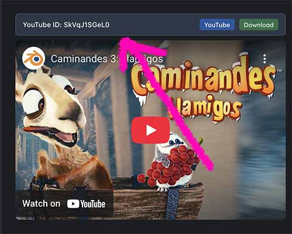

# Embedded Video Detector Safari Extension

A Safari extension that automatically detects embedded videos (YouTube, Reddit, and more) on web pages and provides convenient controls for opening the video in a new tab and for generating the command-line for downloading videos (with yt-dlp or curl where appropriate).

  

This extension was vibe-coded with Cursor as a lark. Most of this README too. I needed this and threw a couple prompts at the problem and probably evaporated away the amount of water needed to slake the thirst of a small country in the process, but I'm impressed things have gotten to the point where something that seems functional and is this complex can come out the other side. I wouldn't advise trusting this code to operate heavy equipment or your pacemaker.

## Features

- **Automatic Detection**: Detects embedded videos in various formats:
  - YouTube videos (`lite-youtube` elements, iframe embeds)
  - Vimeo videos (iframe embeds)
  - Reddit videos (`shreddit-player-2`, `shreddit-player`, `video` elements)
  - Steam game trailers (`video` elements with Steam URLs)
  - Other embedded video formats

- **Video Information**: Displays video details (ID, type, source) above each detected video

- **Direct Video Links**: Provides buttons to open videos directly on their source platforms

- **Download with yt-dlp**: Copies yt-dlp command to clipboard for YouTube and Vimeo videos
- **Download with curl**: Copies curl command to clipboard for Reddit and Steam videos
- **Configurable cookies**: Settings to specify which browser's cookies to use for authentication

## Installation

**Note**: Safari extensions can only be installed from the Mac App Store. This extension is provided as open source for developers and enthusiasts who want to build and run it locally.

### Build from Source

1. Clone this repository:
   ```bash
   git clone https://github.com/czyz/embedded-video-detector.git
   cd embedded-video-detector
   ```
2. Open the project in Xcode by double-clicking `Youtube embed to URL.xcodeproj`
3. Build and run the project (⌘+R)
4. The extension will be automatically installed in Safari
5. Go to **Safari > Settings > Extensions** and enable the extension by checking the checkbox

### System Requirements

- macOS 12.0 or later
- Safari 15.0 or later
- Xcode 14.0 or later (for building from source)
- For video downloads: `yt-dlp` (install via `brew install yt-dlp`)

## Usage

1. Navigate to any webpage that contains YouTube videos
2. The extension will automatically detect YouTube videos and add control panels above them
3. Each control panel shows:
   - The YouTube video ID
   - An "Open on YouTube" button (opens the video on YouTube.com)
   - A "Download with yt-dlp" button

### Downloading Videos

When you click the "Download" button:

1. The appropriate command is automatically copied to your clipboard:
   - **YouTube videos**: yt-dlp command
   - **Reddit videos**: curl command
2. The button briefly shows "Command Copied!" to confirm
3. Open Terminal manually
4. Paste and run the command

**Note**: 
- For YouTube videos, you need to have `yt-dlp` installed on your system. You can install it with:
  ```bash
  brew install yt-dlp
  ```
- For Reddit videos, `curl` is included with macOS by default

### Settings

The extension includes a settings panel where you can configure:

- **Cookies from browser**: Choose which browser's cookies to use for authentication when downloading videos. Options include:
  - Safari (default)
  - Chrome, Firefox, Edge, Brave, Chromium, Opera, Vivaldi, Whale
  - None (no cookies)

This setting is useful if you're logged into YouTube in a different browser than Safari, or if you want to download videos without using cookies.

## Supported Video Formats

The extension detects videos in these formats:

### YouTube Videos:
- `<lite-youtube videoid="VIDEO_ID">` elements
- `<iframe src="https://www.youtube.com/embed/VIDEO_ID">` elements (including with query parameters)
- `<iframe src="https://www.youtube-nocookie.com/embed/VIDEO_ID">` elements
- `<iframe src="https://youtu.be/VIDEO_ID">` elements
- `<shreddit-embed>` elements containing YouTube iframes

### Vimeo Videos:
- `<iframe src="https://player.vimeo.com/video/VIDEO_ID">` elements

### Reddit Videos:
- `<shreddit-player-2>` elements with Reddit-hosted videos

### Steam Videos:
- `<video>` elements with Steam game trailer URLs (`steamstatic.com`)

### Examples of Supported Video URLs:

**YouTube iframe URLs:**
- `https://www.youtube.com/embed/tgbNymZ7vqY`
- `https://www.youtube.com/embed/tgbNymZ7vqY?autoplay=1&mute=1`
- `https://www.youtube.com/embed/GQigLJ6iV4Y?html5=1&enablejsapi=1`
- `https://www.youtube.com/embed/I989pigiJzI?list=PL7dF9e2qSW0aPkIbdB8KfpFLDi0U9Ubgx&mute=1`

**Vimeo iframe URLs:**
- `https://player.vimeo.com/video/1008872622`
- `https://player.vimeo.com/video/1008872622?h=3dec58a0f7`
- `https://player.vimeo.com/video/123456789?autoplay=1&muted=1`

**Steam video URLs:**
- `https://video.akamai.steamstatic.com/store_trailers/257012437/movie480.mp4`
- `https://video.akamai.steamstatic.com/store_trailers/257012437/movie_max.mp4`

## Technical Details

- **Manifest Version**: 3
- **Content Script**: Automatically runs on all web pages
- **Permissions**: `activeTab`, `scripting`
- **Browser Compatibility**: Safari 15+

## Development

To modify the extension:

1. Edit the files in this directory
2. Build and run the project in Xcode (⌘+R)
3. The extension will be automatically reloaded in Safari
4. Test on pages with YouTube videos

### Key Files

- `content.js`: Main logic for detecting videos and adding controls
- `manifest.json`: Extension configuration
- `popup.html/js/css`: Extension popup interface
- `_locales/en/messages.json`: Localization strings

## Changelog

### v1.3.4 (Latest)
- **🎨 CSS Refactoring**: Extracted inline styles to separate CSS file for better maintainability
- **🚫 Smart Page Detection**: Prevents toolbar display on direct Steam video URLs to avoid redundancy
- **🔧 Improved Code Organization**: Better separation of styling and logic

### v1.3.3
- **🎮 Steam Video Support**: Added detection and download support for Steam game trailers
- **🔗 Direct URL Downloads**: Steam videos can be downloaded directly using curl commands
- **🎯 Enhanced Detection**: Detects Steam videos from both video elements and data attributes

### v1.3.2
- **🐛 Bug Fix**: Fixed duplicate control panels appearing on Reddit pages by implementing content-based duplicate prevention
- **🎯 Enhanced Duplicate Prevention**: Added robust video identifier system to prevent multiple UI elements for the same video content
- **🔧 Improved Content Tracking**: Better tracking of processed video content across different element types

### v1.3.1
- **🐛 Bug Fix**: Fixed false positive video detection on non-video content (like background videos on Cursor.com)
- **🎯 Improved Reddit Detection**: Made Reddit video detection more specific to avoid matching decorative videos
- **✅ Better Validation**: Added validation to only show control panels when meaningful video data is available
- **🔧 Enhanced Filtering**: Improved filtering logic to prevent "Reddit unknown" controls on non-Reddit pages

### v1.3.0
- **🎬 Vimeo Video Support**: Added detection and download support for Vimeo videos (both embedded and native pages)
- **🌐 Native Page Support**: Added option to show controls on native YouTube and Vimeo video pages (toggleable in settings)
- **🎯 Enhanced Vimeo Detection**: Robust video ID extraction from URLs and page content for various Vimeo URL formats
- **🔧 Improved YouTube Native Pages**: Better positioning of controls on YouTube native pages with fallback strategies
- **🐛 Bug Fixes**: Fixed Google Developers demo page detection by skipping cross-origin frames
- **⚡ Performance**: Optimized video detection logic and reduced unnecessary processing
- **📱 Better UX**: Cleaner interface on native video pages (removes redundant "YouTube"/"Vimeo" buttons)

### v1.2.0
- **🎯 Enhanced Reddit Video Detection**: Improved detection of Reddit videos including Shadow DOM traversal
- **🔧 Debug Mode**: Added optional debug logging that can be toggled in extension settings (off by default)
- **⚡ Smart Scanning**: Periodic scanning now stops automatically when no new videos are found, improving performance
- **🎨 Improved UI**: Redesigned command modal with modern styling and "Copy & Close" functionality
- **🐛 Bug Fixes**: Fixed issues with Reddit HLS URLs containing query parameters
- **📱 Better UX**: More responsive video detection for asynchronously loaded content

### v1.1.0
- **🔗 Reddit Video Support**: Added detection and download support for Reddit videos
- **🍪 Cookie Configuration**: Added settings to specify which browser's cookies to use
- **📋 Enhanced Download**: Improved command generation for different video types

### v1.0.0
- **🎬 YouTube Detection**: Initial support for YouTube video detection
- **📥 Download Commands**: yt-dlp command generation for YouTube videos
- **🔗 Direct Links**: Quick access to YouTube video pages

## License

This extension is provided as-is for educational and personal use. 